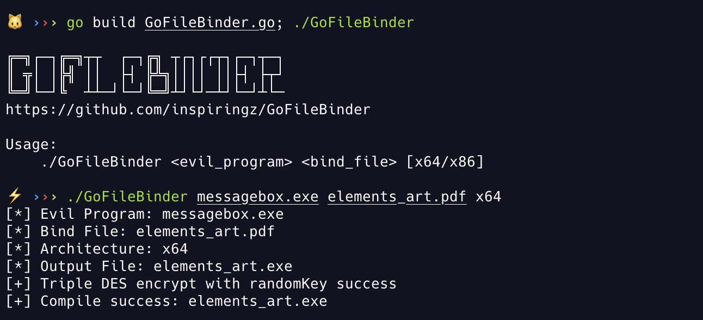
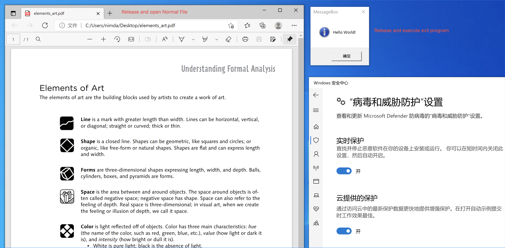

# GoFileBinder

A builder 🔨 for binding evil program 😈 and normal document 🐣



## Usage

Clone this repo and build GoFileBinder.go first, then start:

```bash
./GoFileBinder <evil_program> <bind_file> [x64/x86]
```

Execute the Output File on the target machine, it will release your evil program to `C:\Users\Public\Music\`, and then self-delete after run normal file and evil program.



> You can add an icon to it through [rcedit](https://github.com/electron/rcedit) or [rsrc](https://github.com/akavel/rsrc),note that some icons may be marked as malicious by the anti-virus due to past malicious behavior.

## Feature

- Reduce the risk of being detected by anti-virus ~~and human~~
- Encrypt evil program via 3DES with random key
- Self delete after releasing the normal file and executing the evil program
- Use local variable instead of string literal to pass procedure name (`string([]byte{...})`), to avoid static memory matching

## Reference

- https://github.com/evilashz/NimFileBinder
- https://github.com/EddieIvan01/gld
